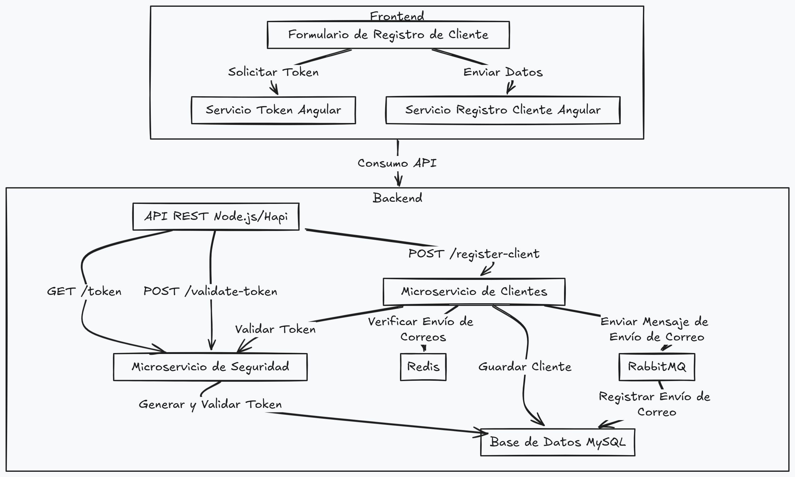
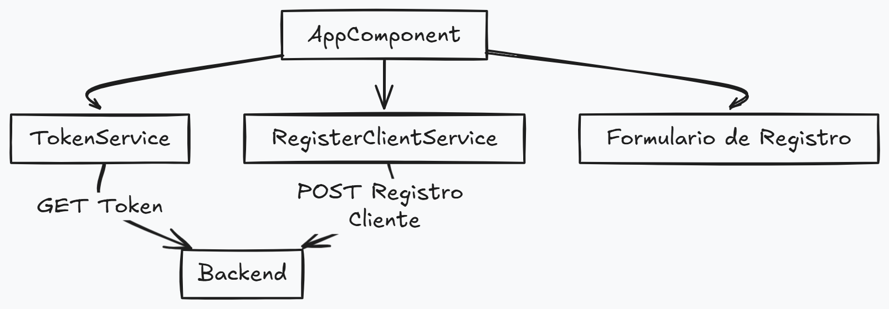

# Proyecto de Registro de Clientes - Frontend

Este proyecto es la parte del frontend de la aplicación para el registro de clientes, desarrollada en **Angular**. El frontend interactúa con los microservicios del backend para registrar clientes y generar un token de seguridad, siguiendo una arquitectura de microservicios.

## Descripción del Proyecto

El proyecto permite que el usuario ingrese su información a través de un formulario de registro, incluyendo el nombre, correo electrónico y un token de seguridad generado previamente. El frontend se encarga de enviar estos datos al backend para su validación y posterior registro en la base de datos.

## Diagrama de Arquitectura




## Requisitos para Ejecutar el Proyecto

- **Node.js**: v14 o superior.
- **Angular CLI**: v17 o superior.

## Instalación y Configuración

### Paso 1: Clonar el Repositorio

```bash
# Clonar el repositorio de GitHub
git clone https://github.com/christian-tong/PruebaTecnica-IAInfinite-Frontend.git
cd PruebaTecnica-IAInfinite-Frontend
```

### Paso 2: Instalar Dependencias

```bash
npm install
```

### Paso 3: Ejecutar el Frontend

Inicia el servidor Angular:

```bash
ng serve
```

El frontend estará disponible en `http://localhost:4200`.

## Proceso de Registro

1. El usuario completa el formulario con su nombre, correo y token de seguridad.
2. El frontend solicita un token al microservicio de seguridad (GET `/token`).
3. El usuario puede modificar el token y luego enviar sus datos.
4. El backend valida el token y registra al cliente en la base de datos.
5. Si la configuración lo permite, se envía una solicitud a RabbitMQ para registrar un correo de bienvenida.



## Contribuciones

Las contribuciones son bienvenidas. Por favor, abre un issue primero para discutir los cambios que deseas realizar.

## Licencia

Este proyecto está bajo la licencia MIT. Consulta el archivo LICENSE para más detalles.
